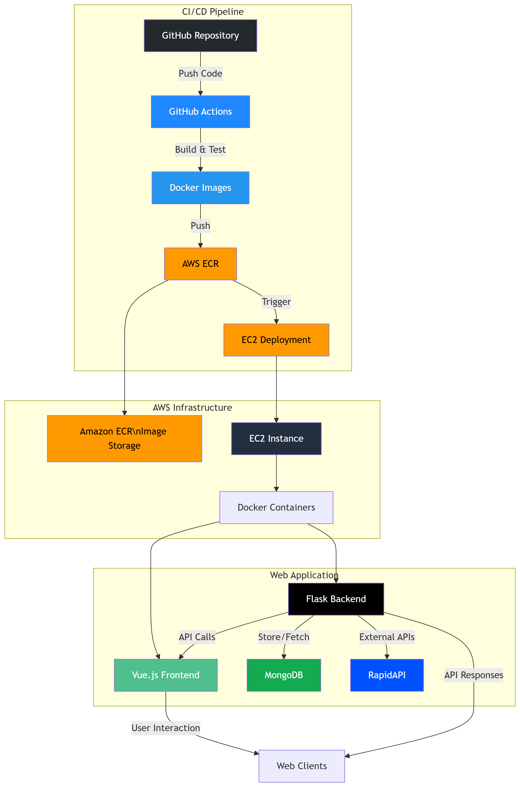

# Vue.js + Flask Web Application

This is a full-stack web application using Vue.js for the frontend and Flask for the backend. The project is containerized using Docker and deployed to AWS ECR and EC2 through GitHub Actions automation.

## Project Structure

```
.
├── frontend/          # Vue.js frontend code
├── backend/           # Flask backend code
├── .github/
│   └── workflows/
│       └── deploy.yml # GitHub Actions workflow configuration
├── Dockerfile.frontend # Frontend Docker configuration
├── Dockerfile.backend  # Backend Docker configuration
├── docker-compose.yml  # Docker Compose configuration
└── nginx.conf         # Nginx configuration
```

## System Architecture



## Tech Stack

- Frontend: Vue.js
- Backend: Flask
- Database: Configured as needed
- Containerization: Docker
- Deployment: AWS ECR + EC2
- CI/CD: GitHub Actions
